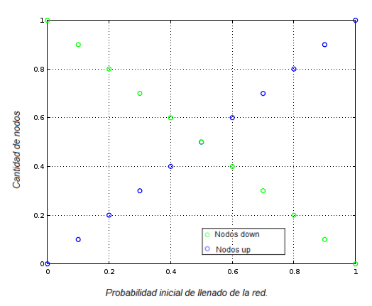

# Tests de funciones

## test _flip_

Compilar como _gcc testflip.c ../src/metropolis.c ../src/lattice.c -lm -o flip_.

El test contempla cuatro casos, donde para cada uno de ellos se llama a la funcion _flip_ 5000 veces (volviendo al spin observado a su configuración original antes de llamar a la función nuevamente), se calcula el promedio del valor del spin observado luego de llamar a _flip_, el cambio de energía y el cambio de magnetización. Los casos considerados se detallan a continuación, donde los sitios están numerados de la siguiente forma:

1  2  3    
4  5  6    
7  8  9    

#### caso 1:

\+ \+ \+  
\+ \+ \+  
\+ \+ \+  

Observamos el sitio 5. Se espera que no se realice un _flip_ y que el cambio de energía y magnetización sean nulos.

#### caso 2:

\+ \+ \+  
\+ \- \+  
\+ \+ \+  

Observamos el sitio 5. Se espera que se realice un _flip_, que el cambio de magnetización sea -2 y que el cambio de energía sea -8.

#### caso 3:

\+ \- \+  
\- \+ \-  
\+ \- \+  

Observamos el sitio 5. Se espera que se realice un _flip_, con cambio de magnetización 2 y cambio de energía -8.

#### caso 4:

\+ \+ \+  
\+ \+ \+  
\+ \+ \-  

Observamos el sitio 9. Se espera que se realice un _flip_, con cambio de magnetización -2 y cambio de energía -8.

## test pick_site

Compilar como _gcc testpicksite.c ../src/metropolis.c -lm -o picksite_.

El programa mprime dos valores numericos.
El primero deberia ser igual a cero si todos los sitios de la red fueron elegidos al menos una vez.
El segundo valor da una idea de que tan equitativamente fueron distribuidas las elecciones de sitio por pick_site.
Si el mismo es igual a 1, quiere decir que todos los sitios fueron elegidos la misma cantidad de veces (puede ser mayor o menor a 1).

## test fill_lattice

Compilar como _gcc testfilllattice.c ../src/lattice.c -lm -o lattice_

El programa llena la red con distintas probabilidades de llenado entre 0 y 1, y se observa como va variando la cantidad de spines up vs. la cantidad de spines down. Se puede graficar el archivo _test.txt_ para observar que esto pasa. El mismo debería verse como el grafico confeccionado a continuación.

